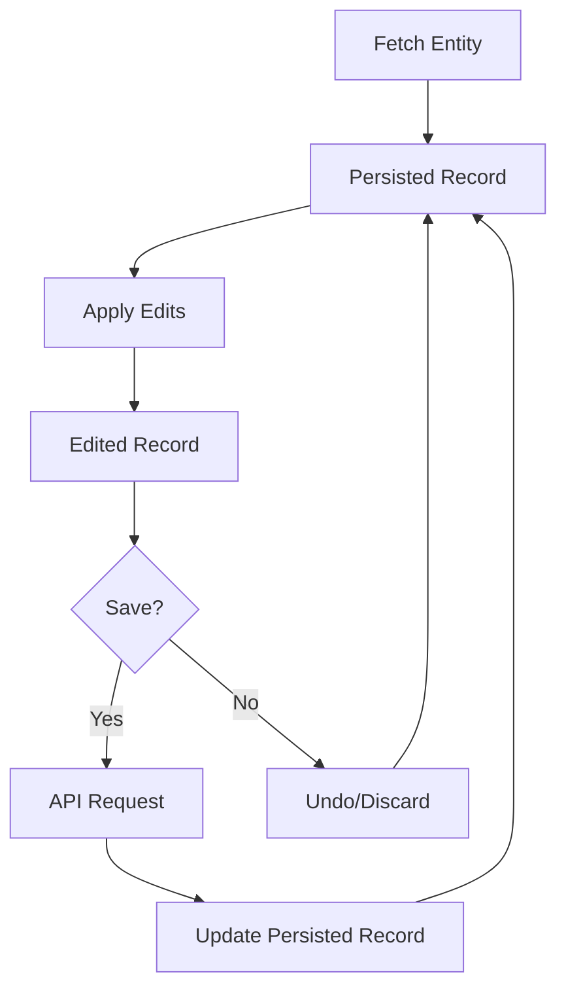

The WordPress editors manipulate entity records - objects representing posts, pages, users, templates, and other WordPress data. The `@wordpress/core-data` package manages these records and provides a unified undo/redo system across multiple simultaneous edits.

## What Are Entities?

An entity represents a data source. Each item within the entity is called an entity record. Entities are defined in the core-data package and map to WordPress REST API endpoints.

### Entity Configuration

Entities are configured with the following properties:

#### kind

Groups related entities together (e.g., `root`, `postType`):

```js
kind: 'root' // For core entities like users, taxonomies
kind: 'postType' // For post types like posts, pages
```

#### name

Unique identifier within the kind:

```js
name: 'user'
name: 'page'
name: 'post'
```

#### baseURL

REST API endpoint path:

```js
baseURL: '/wp/v2/pages'
baseURL: '/wp/v2/users'
```

### Accessing Entities

Entities are accessed using `kind` and `name`:

```js
// Get all pages
wp.data.select( 'core' ).getEntityRecords( 'postType', 'page' );

// Get a specific page
wp.data.select( 'core' ).getEntityRecord( 'postType', 'page', pageId );

// Get all users
wp.data.select( 'core' ).getEntityRecords( 'root', 'user' );
```

### Dynamic Methods

For `root` kind entities, the package creates convenience methods:

```js
// Instead of:
select( 'core' ).getEntityRecords( 'root', 'user' );
select( 'core' ).getEntityRecord( 'root', 'user', userId );

// You can use:
select( 'core' ).getUsers();
select( 'core' ).getUser( userId );
```

## Entity Record States

The core-data store tracks two versions of each entity record:

### Persisted Record

The last state fetched from the backend:

```js
const page = select( 'core' ).getEntityRecord( 'postType', 'page', pageId );
// Returns: { title: { rendered: "My Page", raw: "My Page" }, ... }
```

This represents the saved state without any local modifications.

### Edited Record

The persisted record with local edits applied:

```js
const page = select( 'core' ).getEditedEntityRecord( 'postType', 'page', pageId );
// Returns: { title: "My Updated Page", ... }
```

<Note>
Edited entity records contain raw values as strings, not objects with `rendered` and `raw` properties. This is because JavaScript cannot render server-side dynamic content.
</Note>

## Editing Entities

### Basic Edit Flow

1. **Fetch the entity** (automatically happens when you call a selector)
2. **Apply edits** using `editEntityRecord`
3. **Save changes** using `saveEditedEntityRecord`

```js
// 1. Fetch (happens automatically in useSelect)
const page = useSelect(
  ( select ) => select( coreDataStore ).getEditedEntityRecord(
    'postType',
    'page',
    pageId
  ),
  [ pageId ]
);

// 2. Edit
const { editEntityRecord } = useDispatch( coreDataStore );
editEntityRecord( 'postType', 'page', pageId, { title: 'New Title' } );

// 3. Save
const { saveEditedEntityRecord } = useDispatch( coreDataStore );
await saveEditedEntityRecord( 'postType', 'page', pageId );
```

### Edit Tracking

The store maintains a list of edits for each record:

```js
// Check if there are unsaved edits
const hasEdits = select( 'core' ).hasEditsForEntityRecord(
  'postType',
  'page',
  pageId
);

// Get the specific edits
const edits = select( 'core' ).getEntityRecordEdits(
  'postType',
  'page',
  pageId
);
// Returns: { title: 'New Title' }
```

### Complete Edit Example

```js
import { useSelect, useDispatch } from '@wordpress/data';
import { store as coreDataStore } from '@wordpress/core-data';
import { TextControl, Button } from '@wordpress/components';

function EditPageForm( { pageId } ) {
  const { page, hasEdits, isSaving } = useSelect(
    ( select ) => ({
      page: select( coreDataStore ).getEditedEntityRecord(
        'postType',
        'page',
        pageId
      ),
      hasEdits: select( coreDataStore ).hasEditsForEntityRecord(
        'postType',
        'page',
        pageId
      ),
      isSaving: select( coreDataStore ).isSavingEntityRecord(
        'postType',
        'page',
        pageId
      ),
    }),
    [ pageId ]
  );

  const { editEntityRecord, saveEditedEntityRecord } = useDispatch( coreDataStore );

  const handleChange = ( title ) => {
    editEntityRecord( 'postType', 'page', pageId, { title } );
  };

  const handleSave = async () => {
    await saveEditedEntityRecord( 'postType', 'page', pageId );
  };

  return (
    <div>
      <TextControl
        label="Page title:"
        value={ page.title }
        onChange={ handleChange }
      />
      <Button
        onClick={ handleSave }
        disabled={ ! hasEdits || isSaving }
      >
        { isSaving ? 'Saving...' : 'Save' }
      </Button>
    </div>
  );
}
```

## Creating New Records

For new records without an ID, use `saveEntityRecord` instead:

```js
const { saveEntityRecord } = useDispatch( coreDataStore );

const handleCreate = async () => {
  const newRecord = await saveEntityRecord(
    'postType',
    'page',
    {
      title: 'New Page',
      status: 'publish',
      content: 'Page content',
    }
  );
  
  if ( newRecord ) {
    console.log( 'Created page with ID:', newRecord.id );
  }
};
```

Note the differences from editing:
- Use `saveEntityRecord` (not `saveEditedEntityRecord`)
- Pass the complete record object (not just an ID)
- No `editEntityRecord` call needed

## Undo/Redo System

The WordPress editors support simultaneous editing of multiple entity records. The undo/redo system tracks all changes across entities.

### How It Works

When editing in the Site Editor:
- Edit page title → Creates undo step
- Edit template content → Creates undo step  
- Edit header template part → Creates undo step
- Press undo → Reverts the last change

### Undo/Redo Stack Structure

Each modification stores:

- **Entity kind and name**: Identifies the entity (e.g., `postType`, `page`)
- **Entity Record ID**: The specific record modified
- **Property**: The modified property name (e.g., `title`)
- **From**: Previous value (for undo)
- **To**: New value (for redo)

Example stack:

```js
[
  {
    kind: 'postType',
    name: 'post',
    id: 1,
    property: 'title',
    from: '',
    to: 'Hello World'
  },
  {
    kind: 'postType',
    name: 'post',
    id: 1,
    property: 'slug',
    from: 'previous-slug',
    to: 'hello-world'
  },
  {
    kind: 'postType',
    name: 'wp_block',
    id: 2,
    property: 'title',
    from: 'Reusable Block',
    to: 'Awesome Reusable Block'
  }
]
```

### Using Undo/Redo

```js
import { useDispatch, useSelect } from '@wordpress/data';
import { store as coreDataStore } from '@wordpress/core-data';

function UndoRedoButtons() {
  const { hasUndo, hasRedo } = useSelect(
    ( select ) => ({
      hasUndo: select( coreDataStore ).hasUndo(),
      hasRedo: select( coreDataStore ).hasRedo(),
    }),
    []
  );

  const { undo, redo } = useDispatch( coreDataStore );

  return (
    <div>
      <Button onClick={ undo } disabled={ ! hasUndo }>
        Undo
      </Button>
      <Button onClick={ redo } disabled={ ! hasRedo }>
        Redo
      </Button>
    </div>
  );
}
```

### Cached Changes

Not all edits are immediately added to the undo/redo stack. Some modifications are "cached" to avoid creating excessive undo levels.

#### When Cached Changes Are Used

- Typing in text fields (creates undo level after a delay)
- Rapid successive changes
- Changes marked with `isCached: true` option

```js
// This edit is cached (not immediately added to undo stack)
editEntityRecord(
  'postType',
  'page',
  pageId,
  { title: 'T' },
  { isCached: true }
);

// Cached changes are committed to undo stack when:
// 1. A non-cached edit occurs
// 2. __unstableCreateUndoLevel() is called
// 3. After a delay (in text input scenarios)
```

### Transient Edits

Some edits don't create undo levels at all:

```js
editEntityRecord(
  'postType',
  'page',
  pageId,
  { title: 'New Title' },
  { undoIgnore: true }
);
```

Transient edits are defined in entity configuration and typically include:
- UI state
- Temporary values
- Computed properties

## Multiple Simultaneous Edits

The editor can edit multiple records at once:

```js
// Edit page title
editEntityRecord( 'postType', 'page', 1, { title: 'New Page Title' } );

// Edit template content
editEntityRecord( 'postType', 'wp_template', 5, { content: '<!-- blocks -->' } );

// Edit template part
editEntityRecord( 'postType', 'wp_template_part', 3, { content: '<!-- header -->' } );

// All changes are tracked in the same undo/redo stack
```

When saving:

```js
// Check if any entity has edits
const hasPagesEdits = select( 'core' ).hasEditsForEntityRecord( 'postType', 'page', 1 );
const hasTemplateEdits = select( 'core' ).hasEditsForEntityRecord( 'postType', 'wp_template', 5 );

// Save each edited entity
if ( hasPagesEdits ) {
  await saveEditedEntityRecord( 'postType', 'page', 1 );
}
if ( hasTemplateEdits ) {
  await saveEditedEntityRecord( 'postType', 'wp_template', 5 );
}
```

## Entity Record Lifecycle



## Best Practices

### Always Use getEditedEntityRecord for Forms

```js
// ✅ Correct - reflects user edits
const page = select( 'core' ).getEditedEntityRecord( 'postType', 'page', pageId );

// ❌ Wrong - ignores user edits
const page = select( 'core' ).getEntityRecord( 'postType', 'page', pageId );
```

### Check for Edits Before Saving

```js
const hasEdits = select( 'core' ).hasEditsForEntityRecord(
  'postType',
  'page',
  pageId
);

if ( hasEdits ) {
  await saveEditedEntityRecord( 'postType', 'page', pageId );
}
```

### Handle Save Errors

```js
const savedRecord = await saveEditedEntityRecord( 'postType', 'page', pageId );

if ( ! savedRecord ) {
  const error = select( 'core' ).getLastEntitySaveError(
    'postType',
    'page',
    pageId
  );
  console.error( 'Save failed:', error.message );
}
```

### Clear Edits When Needed

```js
const { clearEntityRecordEdits } = useDispatch( coreDataStore );

// Discard all unsaved changes
clearEntityRecordEdits( 'postType', 'page', pageId );
```

## Next Steps

- [Working with Data](/data/working-with-data) - Learn useSelect and useDispatch patterns
- [Building Forms](/data/building-forms) - Create complete entity editing forms
